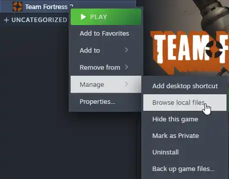

<h3 align="center">Lotus Fortress Localization Vietnamese</h3>

  Bản dịch Tiếng Việt dành cho Team Fortress 2

> [!WARNING]
> Tiến trình biên dịch (cập nhật ngày 17/06/2026): 64% (Các nôi dung tạm thời có thể hiểu và sử dụng)

> [!NOTE]
> Lưu ý : Mọi bản dịch được thực hiện bởi FredCentre và Team Dịch. Đôi lúc sẽ có thiếu sót trong quá trình biên dịch. Nếu bạn muốn đóng góp, bạn hoàn toàn có thể

# CÁCH CÀI ĐẶT
* 1: Tải xuống phiên bản dịch mới nhất tại đây: [HERE!](https://github.com/FredCentre/Lotus-Fortress/releases)
* 2: Chọn file tải về có tên (Lotus-Fortress-TF2-Localization-Vietnamese.VPK) Hãy nhớ đuôi file phải có ".VPK"
* 3: Mở Steam lên vào nhấn chuột phải vào trò chơi sau đó làm theo hình dưới.

  

* 4: Khi steam đã mở thư mục game đi tới `tf\custom`.
* 5: Bỏ file "Lotus-Fortress-TF2-Localization-Vietnamese.VPK" bạn đã tải.
* 6: Tận hưởng thành quả!

# Credits
* Original author: K-M19 & FurBox-Studio
* Contributor: minaly23 & DFK2 & KingDuck404 & FredCentre
* Maintainer: FredCentre

# Tiến trình 

| Quá trình    | tình trạng |
|----------------|---------------|
| Menu | ✔️ |
| Upgrade trong M.v.M| ✔️ |
| Nội dung | ✔️ |
| Chi tiết vũ khí| ✔️  |
| Các tips Class | ✔️  |
| Các nội dung ngoài lề  | ❌ chừa  |
| Nội dung vật phẩm | ❌ chừa |
| Các nội dung Quest/Contracts  | ❌ chừa  |
| Các nội dung chi tiết backgroup | ❌ chừa  |

# Q&A

### Q: Đây là gì?
* A: Đây là bản dịch sang tiếng Việt cho Team Fortress 2 (Không chính thất).

### Q: Tôi có thể đóng góp bản dịch chứ?
* A: Có (Tự do đóng góp)

### Q: TF2 quay trở lại tiếng Anh?
* A: Bạn chỉ cần xoá/gỡ bản mod ra khỏi thứ mục custom là được.

### Q: Một số văn bản vẫn chưa dịch sang tiếng Việt?
* A: Các tên riêng của các (Class nhân vật, Tên bản đồ, tên vũ khí) đều sẽ được giữ nguyên, các văn bản chưa dịch sẽ được dịch sau. Yên tâm!

### Q: Phông chữ bị lỗi/lệch hoặc hiển thị sai?
* A: 1 số vùng chữ có thể bị hiển thị sai hoặc lệch vì do font của của bản dịch thật và Font không tương đồng, nếu bạn gập lỗi hãy thông báo cho chúng tôi tại [Đây](https://github.com/FredCentre/Lotus-Fortress/issues)!!

## Lotus Fortress sử dụng giấy phép [MIT](https://github.com/FredCentre/Lotus-Fortress?tab=MIT-1-ov-file)